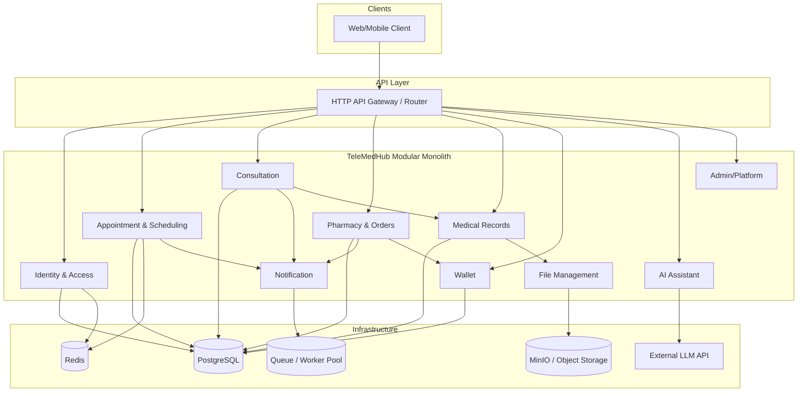
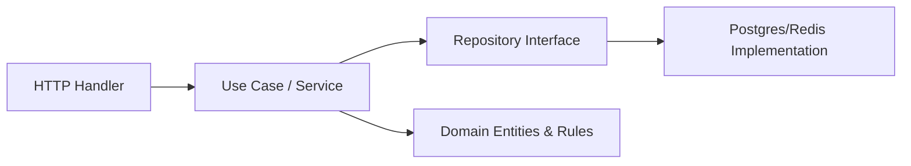
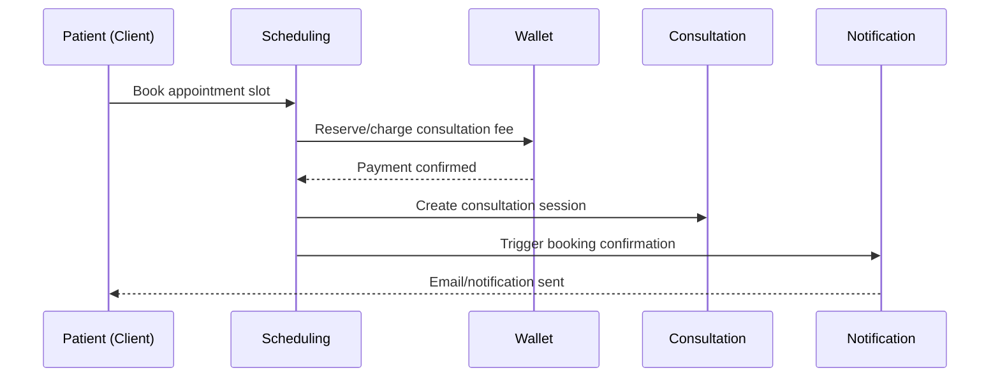

# 03 — System Architecture

## 1. Architecture Style

**Modular Monolith with Clean Architecture boundaries**, designed so individual modules can be extracted into standalone services later without a rewrite.

Rationale is covered in Section 5. In short: a solo/small-team, learning-driven project benefits from a single deployable unit with strict internal module boundaries — this gives most of the maintainability benefits of microservices without the operational overhead of running many services from day one.

## 2. High-Level Architecture



## 3. Main Business Domains

| Domain | Responsibility | Owns Data |
|---|---|---|
| Identity & Access | AuthN/AuthZ, user identity | users, roles, sessions |
| Appointment & Scheduling | Availability, booking | slots, appointments |
| Consultation | Session lifecycle, notes, prescriptions | consultations, prescriptions |
| Pharmacy & Orders | Order lifecycle from prescription | orders, order_items |
| Medical Records | Longitudinal patient history | medical_records, audit_logs |
| Wallet | Balance & transactions | wallets, transactions |
| AI Assistant | Symptom intake & triage suggestion | ai_sessions, ai_suggestions |
| Notification | Multi-channel event dispatch | notifications, delivery_logs |
| File Management | Object storage abstraction | file_metadata |
| Admin/Platform | User/role management, oversight | admin_actions |

## 4. Module Relationships (Dependency Direction)

Each module follows internal Clean Architecture layering:



Cross-module rule: **modules communicate only through well-defined interfaces (in-process function calls today, gRPC/message-based later) — never by reaching into another module's database tables directly.**

Example dependency flow for "Book Appointment → Pay → Consultation":



## 5. Why This Architecture Was Chosen

| Alternative Considered | Why Not (Yet) |
|---|---|
| Full microservices from day one | Excess operational complexity for a solo learner; network-call debugging distracts from core Go/domain learning |
| Simple layered MVC (no domain boundaries) | Would not scale in complexity as more domains (10+) are added; harder to test business logic in isolation |
| Modular Monolith (chosen) | Enforces domain boundaries and testability now; each module can be **extracted into a microservice later** with minimal rewrite because dependencies are already interface-based |

Clean Architecture within each module ensures:
- Business logic (`use case`/`domain`) has **zero dependency** on frameworks, HTTP, or specific databases.
- Infrastructure (Postgres, Redis, MinIO) is swappable behind repository interfaces.
- Every use case is independently unit-testable.

## 6. Suggested Folder Structure (Preview — not final until implementation phase)

```
telemedhub/
  cmd/
    api/                # main entrypoint
  internal/
    identity/
      domain/
      usecase/
      repository/
      handler/
    scheduling/
    consultation/
    pharmacy/
    records/
    wallet/
    ai/
    notification/
    files/
    admin/
    platform/           # shared: config, logger, middleware, db, cache
  pkg/                  # shared reusable utilities (if truly generic)
  migrations/
  docs/
```

## 7. Future Scalability Considerations

| Concern | Path Forward |
|---|---|
| One module becomes a bottleneck (e.g., Notification under high load) | Extract into standalone service, communicate via message queue instead of in-process calls |
| Need for real-time features (chat/video) | Introduce WebSocket gateway alongside REST API; Consultation module gains a streaming interface |
| Multi-region / high availability | Introduce read replicas for PostgreSQL, Redis clustering, and stateless service replication behind a load balancer |
| Service-to-service calls become frequent post-extraction | Introduce gRPC + protobuf contracts between services (Phase 13 of learning roadmap) |
| Multi-tenancy (clinics as tenants) | Add `tenant_id` partitioning at the data layer; evaluate schema-per-tenant vs. row-level tenancy based on scale |
| Compliance hardening (HIPAA/GDPR-like) | Formalize the audit logging already in place; add encryption-at-rest and field-level encryption for PII/PHI |

---

**Next document:** `04-tech-stack.md` — concrete technology choices and rationale.
