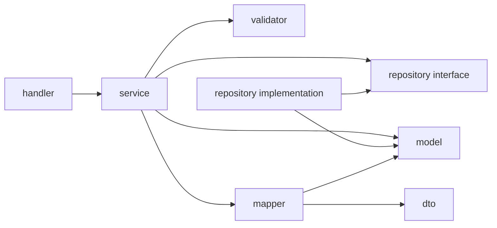
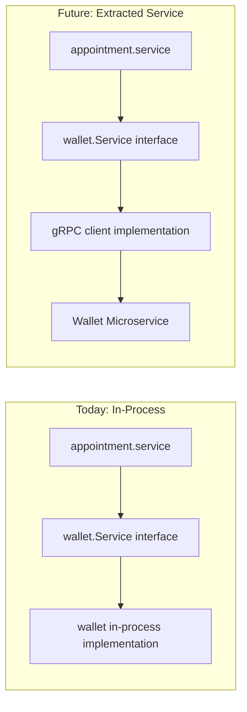

# 05 — Folder Structure

## 1. Why Modular Monolith First

Before the structure itself, it's worth being explicit about the decision this layout encodes:

> **TeleMedHub starts as a Modular Monolith, not Microservices.**

| Reason | Explanation |
|---|---|
| Faster development | One codebase, one build, one deploy — no inter-service network calls to design/debug while the domain model is still evolving |
| Easier learning | You learn Clean Architecture and Go concurrency without also learning distributed systems (service discovery, network retries, distributed tracing) at the same time |
| Lower operational complexity | One binary, one database, one Docker Compose file — no service mesh, no multiple CI/CD pipelines |
| Better debugging | A single call stack across modules; no need to trace a request across process boundaries and logs from multiple services |
| Easier deployment | `docker-compose up` runs the whole platform; no orchestration platform (Kubernetes) required yet |
| Portfolio-suitable | Demonstrates architectural maturity (clear boundaries) without requiring infrastructure most solo developers don't have easy access to |

**The critical design discipline:** every module is built as if it *were* already a separate service — it owns its own data access, exposes a narrow interface, and never reaches into another module's internals. This means that when/if a module needs to be extracted (e.g., Notification under high load, or AI Assistant needing independent scaling), the extraction is a **deployment change**, not a **rewrite**.

This folder structure exists to enforce that discipline mechanically — the compiler and package boundaries will stop you from accidentally coupling modules together.

---

## 2. Top-Level Layout

```
telemedhub/
├── cmd/
│   └── api/
│       └── main.go
├── internal/
│   ├── auth/
│   ├── user/
│   ├── doctor/
│   ├── patient/
│   ├── appointment/
│   ├── consultation/
│   ├── prescription/
│   ├── pharmacy/
│   ├── inventory/
│   ├── wallet/
│   ├── notification/
│   ├── ai/
│   ├── file/
│   └── shared/
├── pkg/
│   ├── logger/
│   ├── httpresponse/
│   └── validator/
├── configs/
│   ├── config.yaml
│   └── config.example.yaml
├── docs/
│   ├── 00-project-overview.md
│   ├── ...
│   └── openapi/
├── scripts/
│   ├── migrate.sh
│   ├── seed.sh
│   └── lint.sh
├── deployments/
│   ├── docker-compose.yml
│   ├── docker-compose.override.yml
│   └── Dockerfile
├── migrations/
│   ├── 0001_create_users.up.sql
│   └── 0001_create_users.down.sql
├── test/
│   ├── integration/
│   └── fixtures/
├── go.mod
└── go.sum
```

---

## 3. Top-Level Folder Responsibilities

| Folder | Responsibility |
|---|---|
| `cmd/` | Application entrypoints. Each subfolder is a separate binary. `cmd/api` wires up config, DB, all modules, and starts the HTTP server. If a worker process is added later (e.g., `cmd/worker` for notifications), it lives here too. |
| `internal/` | All business logic and domain modules. Go enforces that nothing outside this repository can import from `internal/` — this is intentional: it keeps domain logic private to the project. |
| `pkg/` | Truly generic, reusable code with **no domain knowledge** — things you could copy into an unrelated project (a logger wrapper, a standard HTTP response envelope, generic validator helpers). If a "shared" utility knows about `Patient` or `Appointment`, it does **not** belong here — it belongs in `internal/shared`. |
| `configs/` | Environment/config file templates. Actual secrets are injected via environment variables at runtime; `config.yaml`/`config.example.yaml` define structure and defaults, never real secrets. |
| `docs/` | All project documentation (the files you're reading now), plus generated OpenAPI specs. |
| `scripts/` | Developer tooling: migration runner, database seeding, linting, local setup helpers. |
| `deployments/` | Everything needed to run the system: Dockerfile, Docker Compose files (base + override for local dev). |
| `migrations/` | Versioned SQL migration files (up/down pairs), run via a migration tool (e.g., `golang-migrate`). |
| `test/` | Cross-module integration tests and shared test fixtures/data. Unit tests live alongside the code they test (`_test.go` files inside each module), not here. |

---

## 4. Module Internal Structure

Every module under `internal/` follows the same Clean Architecture-inspired shape:

```
internal/appointment/
├── handler/
│   └── appointment_handler.go
├── service/
│   └── appointment_service.go
├── repository/
│   ├── appointment_repository.go        # interface
│   └── postgres_appointment_repo.go     # implementation
├── model/
│   └── appointment.go                   # domain entity
├── dto/
│   ├── request.go
│   └── response.go
├── validator/
│   └── appointment_validator.go
├── mapper/
│   └── appointment_mapper.go
└── appointment_module.go                # wiring/constructor for this module
```

### Sub-folder responsibilities

| Folder | Responsibility | Depends On |
|---|---|---|
| `model/` | Domain entities and business rules. Pure Go structs + methods expressing domain logic (e.g., `Appointment.CanBeCancelled()`). **No** framework, DB, or HTTP imports. | Nothing (innermost layer) |
| `dto/` | Data Transfer Objects — request/response shapes exposed over HTTP. Decouples the external API contract from internal domain models. | `model/` (for mapping only) |
| `validator/` | Input validation logic for incoming DTOs (required fields, format checks, business-rule pre-checks). | `dto/` |
| `mapper/` | Converts between `model` (domain) and `dto` (API) representations, and between `model` and DB row structs if needed. | `model/`, `dto/` |
| `repository/` | Defines a Go **interface** for data access (`Save`, `FindByID`, etc.) plus a concrete implementation (e.g., Postgres). Business logic depends on the interface, never the implementation directly. | `model/` |
| `service/` | Use cases / application logic. Orchestrates validation, domain rules, repository calls, and calls to other modules' **public interfaces**. This is where "book an appointment" or "cancel a consultation" logic lives. | `model/`, `repository/` (interface), `validator/`, `mapper/`, other modules' public interfaces |
| `handler/` | HTTP layer — parses requests, calls `service/`, writes HTTP responses. Thin: no business logic here. | `service/`, `dto/` |
| `*_module.go` | Wires the module together (constructs repository → service → handler) and exposes what the module allows other modules to call. | All of the above |

### Dependency direction (per module)



**Rule:** dependencies always point *inward*, toward `model/`. `model/` depends on nothing else in the module.

---

## 5. Module List and Purpose

| Module | Purpose |
|---|---|
| `auth` | Registration, login, JWT issuance/verification, password management |
| `user` | Shared user identity data (used by both doctor and patient profiles) |
| `doctor` | Doctor profile, credentials, verification status, availability |
| `patient` | Patient profile, preferences |
| `appointment` | Slot management, booking, cancellation/rescheduling |
| `consultation` | Consultation session lifecycle, notes |
| `prescription` | Prescription issuance tied to a consultation |
| `pharmacy` | Pharmacy order lifecycle from a prescription |
| `inventory` | Medicine catalog/stock data referenced by pharmacy orders |
| `wallet` | Balance management, transactions, ledger |
| `notification` | Event-driven notification dispatch (email now, others later) |
| `ai` | Symptom intake, LLM integration, triage suggestion storage |
| `file` | Upload/download via MinIO, presigned URLs, access checks |
| `shared` | Cross-cutting domain concerns used by multiple modules — see below |

### What belongs in `internal/shared`

`shared` is for code that has **domain knowledge** but is genuinely needed by more than one module and doesn't naturally "belong" to a single one:

- **`AuditService` interface** — the single write path for `audit_logs`. Every module that performs an audited action (medical record access, prescription issuance, role assignment) calls this interface. The concrete implementation in `shared` writes to the DB. This pattern matches how `notification.Service` is used across modules.
  ```go
  // internal/shared/audit.go
  type AuditEntry struct {
      ActorID    uuid.UUID
      Action     string        // e.g., "medical_record.viewed"
      TargetType string        // e.g., "medical_records"
      TargetID   uuid.UUID
      IPAddress  string
      Metadata   map[string]any
  }
  type AuditService interface {
      Log(ctx context.Context, entry AuditEntry) error
  }
  ```
- Common domain value objects (e.g., `Money`, `Pagination`, `AuditFields`)
- Shared middleware that needs domain context (e.g., RBAC middleware that reads roles)
- Common DB/cache/config wiring helpers used across modules' `*_module.go` files

`shared` must **never** import from a specific business module (e.g., `shared` cannot import `appointment`). The dependency only flows one way: business modules may depend on `shared`, never the reverse.

---

## 6. Rules: What Must Never Depend on What

| Rule | Why |
|---|---|
| `model/` never imports `handler/`, `repository/`, `dto/`, or any framework/DB package | Keeps business rules testable in complete isolation and framework-agnostic |
| One module never imports another module's `repository/`, `model/`, or internal packages directly | Prevents tight coupling; this is the boundary that makes future microservice extraction possible |
| Cross-module calls go through an explicitly exposed interface in the target module's `*_module.go` (e.g., `wallet.Service` interface), never through direct struct/field access | Makes the "real" contract between modules explicit and mockable in tests |
| `pkg/` never imports from `internal/` | `pkg/` must remain domain-agnostic and reusable outside this project |
| `shared` never imports a specific business module | Prevents circular dependencies and hidden coupling through the "shared" back door |
| `handler/` never contains business logic (conditionals about business rules, calculations) | Keeps the HTTP layer swappable (e.g., adding gRPC handlers later without touching business logic) |
| `prescription.Service` depends on `consultation.Service` (public interface only) to validate that a consultation exists and is `completed` before issuing a prescription — never on `consultation.Repository` directly | Enforces module boundary; if `consultation` were extracted to a microservice, only the interface implementation changes, not `prescription` |
| All modules that perform audited actions (medical records read/write, prescription issuance, role assignment) must call `shared.AuditService.Log(ctx, entry)` — never insert directly into `audit_logs` | Enforces consistent audit format; makes audit write path mockable in tests; ensures PHI-touching actions are never silently unlogged |

A simple mental test before writing an import: *"If `appointment` were extracted into its own microservice tomorrow, would this import still compile?"* If not, the dependency is wrong.

---

## 7. Cross-Module Communication Pattern (Preparing for Future Microservices)

Today, one module calls another via a Go interface, in-process:

```go
// inside appointment/service/appointment_service.go
type AppointmentService struct {
    walletService wallet.Service // interface, not concrete struct
    notifier      notification.Service
}
```

When a module is later extracted into its own microservice, this interface implementation is swapped from an in-process call to a gRPC client implementing the **same interface**. The calling module's code does not change — only the wiring in `*_module.go` does.



This is the concrete mechanism behind the "minimal refactor" promise of the Modular Monolith decision.

---

**Next document:** `06-database-design.md` — relational schema, ERD, and table rationale.

---

## 8. Architectural Domain → Go Module Mapping

The system architecture (`03-system-architecture.md`) describes 10 high-level domains. These map to more granular Go packages inside `internal/` as follows:

| Architectural Domain | Go Module(s) in `internal/` | Notes |
|---|---|---|
| Identity & Access | `auth`, `user` | `auth` owns login/token logic; `user` owns shared identity data (profile, roles) |
| Doctor | `doctor` | Doctor profile, credentials, availability slots |
| Patient | `patient` | Patient profile, preferences |
| Appointment & Scheduling | `appointment` | Slot booking, cancellation, reschedule; depends on `doctor` (availability) and `wallet` (payment) |
| Consultation | `consultation`, `prescription` | `consultation` owns session lifecycle; `prescription` owns prescription issuance (depends on `consultation.Service` interface) |
| Pharmacy & Orders | `pharmacy`, `inventory` | `pharmacy` owns order lifecycle; `inventory` owns medicine catalog/stock |
| Wallet | `wallet` | Balance management, ledger, idempotency |
| Medical Records | `medical_records` (or `records`) | Longitudinal patient history; every access triggers `shared.AuditService.Log` |
| AI Assistant | `ai` | LLM integration, triage suggestion, PHI-stripped prompt building |
| Notification | `notification` | Async dispatch via Redis Streams worker pool |
| File Management | `file` | MinIO abstraction, presigned URLs, access control |
| Admin/Platform | `admin` | User management, role assignment, audit log queries |
| Cross-cutting | `shared` | `AuditService` interface, `Money`/`Pagination` value objects, RBAC middleware, DB/cache wiring helpers |

This mapping is the authoritative translation between architecture docs and code. When in doubt which module a piece of logic belongs to, consult this table.
