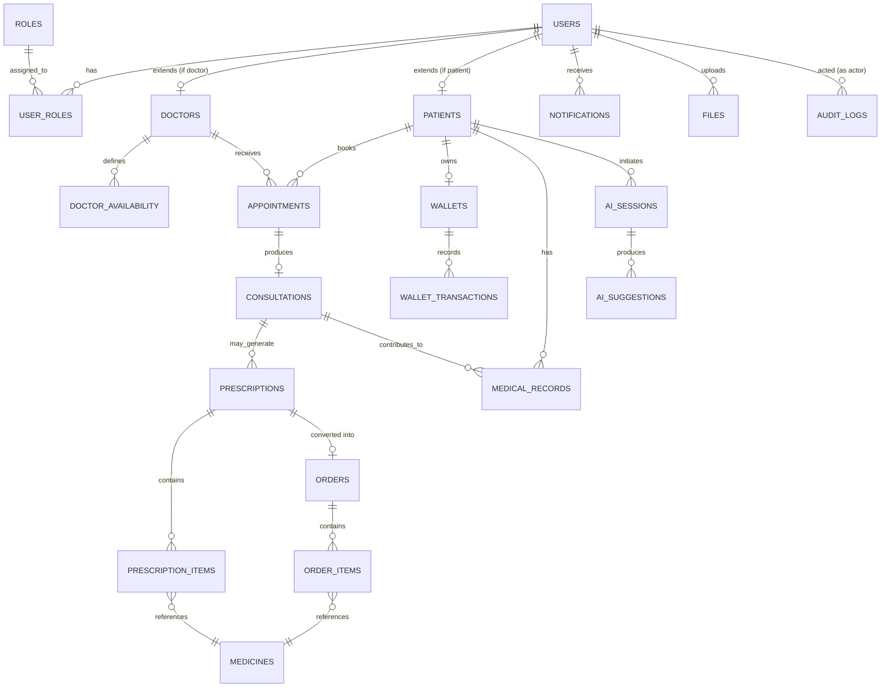

# 06 — Database Design

No SQL is included here by design — this document defines the *shape* of the data model. Actual migration SQL is an implementation detail written later, guided by this document.

---

## 1. Conventions

### 1.1 Naming Conventions

| Rule | Example |
|---|---|
| Tables: plural, snake_case | `appointments`, `medical_records` |
| Columns: snake_case | `created_at`, `doctor_id` |
| Primary key: `id` (UUID) | `id UUID` |
| Foreign key: `<singular_table>_id` | `patient_id`, `doctor_id` |
| Boolean columns: prefixed `is_`/`has_` | `is_verified`, `has_allergies` |
| Enum-like status columns: `status` | `status` (e.g., `pending`, `confirmed`) |
| Timestamp columns: suffixed `_at` | `created_at`, `cancelled_at` |

UUIDs are used for primary keys (rather than auto-increment integers) because:
- They avoid leaking record counts/order through the API.
- They allow IDs to be generated in the application layer before insert (useful for events/outbox patterns later).

### 1.2 Timezone Convention

> **All timestamps are stored in UTC.** All business logic operates in UTC. API responses include the UTC offset (e.g., `2026-07-10T09:00:00Z`). Display timezone conversion is a client responsibility.
>
> This rule is enforced at the application layer (Go's `time.UTC` before any DB write) and at the PostgreSQL layer by using `TIMESTAMP WITH TIME ZONE` (`timestamptz`) for all timestamp columns.

### 1.3 Audit Fields (on every table)

| Column | Type | Purpose |
|---|---|---|
| `created_at` | timestamptz | Record creation time (UTC) |
| `updated_at` | timestamptz | Last modification time (UTC) |
| `created_by` | UUID (nullable) | User/system actor who created the record (nullable for system-generated rows) |
| `updated_by` | UUID (nullable) | User/system actor who last modified the record |
| `deleted_by` | UUID (nullable) | User/system actor who soft-deleted the record (only on soft-delete tables) |

### 1.4 Soft Delete Strategy

Tables holding user-facing or legally/medically significant data use **soft delete** via a `deleted_at` (nullable timestamptz) column instead of hard deletion:

- `deleted_at IS NULL` → active record
- `deleted_at IS NOT NULL` → considered deleted, excluded from normal queries, retained for audit/compliance

Soft delete applies to: `users`, `doctors`, `patients`, `appointments`, `consultations`, `prescriptions`, `orders`, `medical_records`, `wallets`, `files`.

Soft delete does **not** apply to append-only/immutable tables where deletion doesn't make sense: `wallet_transactions`, `audit_logs`, `notifications`, `ai_suggestions` — these are historical records and are never deleted, only optionally archived.

---

## 2. Business Domains → Tables

| Domain | Tables |
|---|---|
| Identity & Access | `users`, `roles`, `user_roles` |
| Doctor | `doctors`, `doctor_availability` |
| Patient | `patients` |
| Appointment & Scheduling | `appointments` |
| Consultation | `consultations` |
| Prescription | `prescriptions`, `prescription_items` |
| Pharmacy & Orders | `orders`, `order_items` |
| Inventory | `medicines` |
| Wallet | `wallets`, `wallet_transactions` |
| Medical Records | `medical_records` |
| AI Assistant | `ai_sessions`, `ai_suggestions` |
| Notification | `notifications` |
| File Management | `files` |
| Admin/Platform | `audit_logs` |

---

## 3. Entity Relationship Diagram



---

## 4. Table Descriptions

### 4.1 `users`
**Why it exists:** Single source of identity shared by both patients and doctors, so authentication logic doesn't need to be duplicated per role.

| Column | Notes |
|---|---|
| `id` | PK (UUID) |
| `email` | Unique, used for login |
| `phone_number` | VARCHAR(20), unique, nullable — required for SMS notifications (future) and secondary identity verification |
| `password_hash` | Argon2id hash (never bcrypt — see `04-tech-stack.md`) |
| `full_name` | |
| `is_verified` | Email/identity verification flag |
| `status` | `active`, `suspended`, `deactivated` |
| audit + soft-delete fields | (including `deleted_by`) |

**Indexes:** unique index on `email`; unique index on `phone_number` (partial, excluding `NULL`).

### 4.2 `roles`, `user_roles`
**Why they exist:** Decouples permission logic from the `users` table, allowing a user to hold multiple roles (rare, but future-proof — e.g., an admin who is also a doctor).

`roles`: `id`, `name` (`patient`, `doctor`, `pharmacy_staff`, `admin`).
`user_roles`: `id`, `user_id` (FK → users), `role_id` (FK → roles).

**Indexes:** composite unique index on (`user_id`, `role_id`).

### 4.3 `doctors`
**Why it exists:** Doctor-specific attributes that don't belong on the generic `users` table.

| Column | Notes |
|---|---|
| `id` | PK |
| `user_id` | FK → `users.id`, unique |
| `specialty` | |
| `license_number` | |
| `is_credential_verified` | Admin-verified flag before doctor is publicly bookable |
| `consultation_fee` | |

**Indexes:** unique index on `user_id`; index on `specialty` for search.

### 4.4 `patients`
**Why it exists:** Patient-specific attributes (distinct from `users` for the same reason as `doctors`).

| Column | Notes |
|---|---|
| `id` | PK |
| `user_id` | FK → `users.id`, unique |
| `date_of_birth` | |
| `gender` | |
| `blood_type` | nullable |

### 4.5 `doctor_availability`
**Why it exists:** Represents bookable time slots independently from actual appointments, so a doctor's schedule can be defined once and queried efficiently.

| Column | Notes |
|---|---|
| `id` | PK |
| `doctor_id` | FK → `doctors.id` |
| `start_time` / `end_time` | |
| `is_booked` | Denormalized flag for fast availability lookups |

**Indexes:** composite index on (`doctor_id`, `start_time`) — this is the query pattern for "find available slots for doctor X".

### 4.6 `appointments`
**Why it exists:** Core booking record linking a patient, doctor, and a specific time slot.

| Column | Notes |
|---|---|
| `id` | PK |
| `patient_id` | FK → `patients.id` |
| `doctor_id` | FK → `doctors.id` |
| `availability_id` | FK → `doctor_availability.id` |
| `status` | `pending`, `confirmed`, `cancelled`, `completed` |
| `scheduled_at` | timestamptz (UTC) |
| `cancelled_at` | timestamptz, nullable |
| `cancel_reason` | TEXT, nullable |

**Constraints:**
- Partial unique index on `availability_id` for non-cancelled appointments — implemented as:
  ```sql
  CREATE UNIQUE INDEX uq_appointments_availability_active
    ON appointments (availability_id)
    WHERE status NOT IN ('cancelled');
  ```
  This is a **partial index**, NOT a plain `UNIQUE` constraint — a plain constraint would prevent a cancelled slot from ever being rebooked, breaking the reschedule flow.

**Indexes:** index on (`patient_id`, `status`), index on (`doctor_id`, `scheduled_at`).

### 4.7 `consultations`
**Why it exists:** Represents the actual consultation session, separate from the appointment record — an appointment can exist without a consultation ever starting (e.g., no-show).

| Column | Notes |
|---|---|
| `id` | PK |
| `appointment_id` | FK → `appointments.id`, unique |
| `status` | `scheduled`, `in_progress`, `completed`, `cancelled` |
| `notes` | Doctor's consultation notes |
| `started_at` / `ended_at` | |

### 4.8 `prescriptions`, `prescription_items`
**Why they exist:** A prescription is issued from a consultation and can contain multiple medicines — separated into a header/line-item pattern for clean querying and reuse (an order can reference the same structure).

`prescriptions`: `id`, `consultation_id` (FK), `patient_id` (FK), `doctor_id` (FK), `issued_at`, `status` (`active`, `fulfilled`, `expired`).

`prescription_items`: `id`, `prescription_id` (FK), `medicine_id` (FK → `medicines`), `dosage`, `quantity`, `instructions`.

**Indexes:** index on `prescription_id` in `prescription_items`.

### 4.9 `medicines`
**Why it exists:** Reference catalog of dispensable medicines, decoupled from any single prescription/order so stock and pricing data has one source of truth.

| Column | Notes |
|---|---|
| `id` | PK |
| `name` | |
| `unit_price` | NUMERIC(12,2) — not FLOAT, to avoid floating-point precision issues with money |
| `stock_quantity` | INTEGER, `CHECK (stock_quantity >= 0)` — DB-level guard against negative stock |
| `requires_prescription` | boolean |

**Stock locking strategy:** Concurrent order creation uses pessimistic locking:
```sql
-- Inside the order creation transaction:
SELECT id, stock_quantity FROM medicines WHERE id = $1 FOR UPDATE;
-- Then verify stock, decrement, and create order_items atomically.
```
If `stock_quantity < requested_quantity`, the transaction rolls back with `OUT_OF_STOCK` error. The `CHECK` constraint is a last-resort guard.

**Indexes:** index on `name` for search.

### 4.10 `orders`, `order_items`
**Why they exist:** A pharmacy order is created from a prescription (or, for non-prescription items, directly by a patient) and tracked through a fulfillment lifecycle independent of the prescription's own lifecycle.

`orders`: `id`, `patient_id` (FK), `prescription_id` (FK, nullable), `status` (`pending`, `processing`, `shipped`, `delivered`, `cancelled`), `total_amount`.

`order_items`: `id`, `order_id` (FK), `medicine_id` (FK), `quantity`, `unit_price` (snapshotted at order time — prices can change later, but historical orders must reflect the price paid).

**Indexes:** index on (`patient_id`, `status`); index on `order_id` in `order_items`.

### 4.11 `wallets`, `wallet_transactions`
**Why they exist:** `wallets` holds the current balance (one row per patient); `wallet_transactions` is an **append-only ledger** — the source of truth for how the balance was derived, essential for auditability of a financial feature.

`wallets`: `id`, `patient_id` (FK, unique), `balance` — `CHECK (balance >= 0)` enforced at DB level.

`wallet_transactions`:

| Column | Notes |
|---|---|
| `id` | PK |
| `wallet_id` | FK → `wallets.id` |
| `type` | `top_up`, `consultation_payment`, `order_payment`, `refund` |
| `amount` | NUMERIC(12,2), positive value; direction implied by `type` |
| `reference_id` | UUID, nullable — links to `appointments.id` or `orders.id` |
| `balance_after` | NUMERIC(12,2) — snapshot of balance after this transaction, for ledger verification |
| `idempotency_key` | VARCHAR(128), unique, nullable — stored when client provides `Idempotency-Key` header. On duplicate key: return original transaction response, do not create new row |
| `created_at` | timestamptz |

**Indexes:** index on (`wallet_id`, `created_at`) for transaction history queries; unique index on `idempotency_key` (partial, excluding `NULL`).

**Design note:** `balance` on `wallets` is a denormalized, continuously-updated value for fast reads; `wallet_transactions.balance_after` provides a way to verify balance correctness by replaying the ledger — a standard financial-ledger pattern.

### 4.12 `medical_records`
**Why it exists:** Longitudinal patient history, decoupled from any single consultation, so a patient's medical history persists and accumulates across many consultations over time.

| Column | Notes |
|---|---|
| `id` | PK |
| `patient_id` | FK |
| `consultation_id` | FK, nullable (some record entries may be manually added, not tied to a specific consultation) |
| `record_type` | `diagnosis`, `allergy`, `lab_result`, `note` |
| `content` | Structured or free text |
| `file_id` | FK → `files.id`, nullable (attached lab result/document) |

**Indexes:** index on (`patient_id`, `record_type`).

### 4.13 `ai_sessions`, `ai_suggestions`
**Why they exist:** Separates the patient's symptom-intake conversation (`ai_sessions`) from the discrete suggestion(s) the AI produced (`ai_suggestions`), since a session may span multiple back-and-forth exchanges.

`ai_sessions`: `id`, `patient_id` (FK), `status` (`active`, `closed`).

`ai_suggestions`: `id`, `session_id` (FK), `input_summary`, `suggested_urgency` (`low`, `medium`, `high`), `suggested_specialty`, `disclaimer_shown` (boolean — always `true`, stored for audit).

### 4.14 `notifications`
**Why it exists:** Tracks every notification dispatched, regardless of channel, for delivery auditing and in-app notification history.

| Column | Notes |
|---|---|
| `id` | PK |
| `user_id` | FK |
| `channel` | `email`, `push`, `sms` (future) |
| `type` | `appointment_reminder`, `order_status`, `appointment_confirmed`, etc. |
| `status` | `pending`, `sent`, `failed` |
| `payload` | JSONB snapshot of the notification content |
| `retry_count` | INTEGER, DEFAULT 0 — incremented on each retry attempt |
| `last_attempted_at` | timestamptz, nullable — timestamp of most recent dispatch attempt |
| `sent_at` | timestamptz, nullable — set when status transitions to `sent` |
| `failed_at` | timestamptz, nullable — set when retry_count exceeds limit and status transitions to `failed` |

**Indexes:** index on (`user_id`, `status`); index on (`status`, `retry_count`) for the background worker queue query (find pending/failed notifications eligible for retry).

### 4.15 `files`
**Why it exists:** Metadata for objects stored in MinIO — the actual binary lives in object storage; this table tracks ownership and access rules.

| Column | Notes |
|---|---|
| `id` | PK |
| `owner_id` | FK → `users.id` |
| `bucket` / `object_key` | Location in MinIO |
| `content_type` | |
| `visibility` | `private`, `shared` |

### 4.16 `audit_logs`
**Why it exists:** Immutable record of sensitive actions (especially medical record access), required both for the platform's own trust model and to prepare for future compliance certification.

| Column | Notes |
|---|---|
| `id` | PK |
| `actor_id` | FK → `users.id` |
| `action` | e.g., `medical_record.viewed`, `prescription.issued`, `user.role_assigned` |
| `target_type` / `target_id` | Polymorphic reference to the affected entity |
| `ip_address` | VARCHAR(45) — source IP of the request (IPv4 or IPv6) |
| `user_agent` | TEXT, nullable — HTTP User-Agent for device context |
| `metadata` | JSONB, contextual details |
| `created_at` | timestamptz |

**Indexes:** index on (`target_type`, `target_id`); index on (`actor_id`, `created_at`).

**Write path:** All audit log writes go through the shared `AuditService` interface defined in `internal/shared`. No module writes directly to this table — they call `AuditService.Log(ctx, entry)`. This enforces a consistent audit format and makes the write path mockable in tests.

### 4.17 `refresh_tokens`
**Why it exists:** Stores issued refresh tokens for validation and revocation. Without this table, the `/auth/refresh` and `/auth/logout` endpoints cannot verify token legitimacy or enforce logout.

| Column | Notes |
|---|---|
| `id` | PK (UUID) |
| `user_id` | FK → `users.id` |
| `token_hash` | VARCHAR(255) — Argon2id hash of the raw refresh token (never store raw token) |
| `expires_at` | timestamptz — token expiry (30 days from issuance) |
| `revoked_at` | timestamptz, nullable — set on logout or admin-forced revocation |
| `user_agent` | TEXT, nullable — device context for suspicious activity detection |
| `ip_address` | VARCHAR(45), nullable — issuing request's source IP |
| `created_at` | timestamptz |

**Indexes:** index on `user_id`; index on (`user_id`, `revoked_at`) for listing active sessions.

**Design note:** Raw refresh tokens are never stored. Only the Argon2id hash is persisted. On `/auth/refresh`, the client presents the raw token; the server hashes it and compares against stored hashes for the user. On `/auth/logout`, the token record's `revoked_at` is set. On `/auth/refresh`, revoked or expired tokens return `401`.

---

## 5. Foreign Key & Constraint Summary

| Table | Foreign Keys | Notable Constraints |
|---|---|---|
| `user_roles` | `user_id → users`, `role_id → roles` | unique(`user_id`, `role_id`) |
| `doctors` | `user_id → users` | unique(`user_id`) |
| `patients` | `user_id → users` | unique(`user_id`) |
| `doctor_availability` | `doctor_id → doctors` | — |
| `appointments` | `patient_id → patients`, `doctor_id → doctors`, `availability_id → doctor_availability` | **partial unique index** on `availability_id` WHERE status NOT IN ('cancelled') |
| `consultations` | `appointment_id → appointments` | unique(`appointment_id`) |
| `prescriptions` | `consultation_id → consultations`, `patient_id → patients`, `doctor_id → doctors` | — |
| `prescription_items` | `prescription_id → prescriptions`, `medicine_id → medicines` | `quantity > 0` |
| `orders` | `patient_id → patients`, `prescription_id → prescriptions` (nullable) | — |
| `order_items` | `order_id → orders`, `medicine_id → medicines` | `quantity > 0` |
| `wallets` | `patient_id → patients` | unique(`patient_id`), `balance >= 0` |
| `wallet_transactions` | `wallet_id → wallets` | unique partial index on `idempotency_key` (excluding NULL) |
| `medical_records` | `patient_id → patients`, `consultation_id → consultations` (nullable), `file_id → files` (nullable) | — |
| `ai_sessions` | `patient_id → patients` | — |
| `ai_suggestions` | `session_id → ai_sessions` | — |
| `notifications` | `user_id → users` | — |
| `files` | `owner_id → users` | — |
| `audit_logs` | `actor_id → users` | — |
| `refresh_tokens` | `user_id → users` | — |

---

## 6. Index Recommendations Summary

| Purpose | Index |
|---|---|
| Login lookup | `users(email)` unique |
| Phone lookup | `users(phone_number)` unique partial (excluding NULL) |
| Doctor search by specialty | `doctors(specialty)` |
| Availability lookup | `doctor_availability(doctor_id, start_time)` |
| Prevent double-booking | `appointments(availability_id)` **partial unique** WHERE status NOT IN ('cancelled') |
| Patient's appointment history | `appointments(patient_id, status)` |
| Doctor's schedule | `appointments(doctor_id, scheduled_at)` |
| Consultation by status | `consultations(status)` |
| Wallet transaction history | `wallet_transactions(wallet_id, created_at)` |
| Idempotency dedup | `wallet_transactions(idempotency_key)` unique partial (excluding NULL) |
| Medical record retrieval by type | `medical_records(patient_id, record_type)` |
| Notification inbox | `notifications(user_id, status)` |
| Notification worker queue | `notifications(status, retry_count)` |
| Audit trail lookup | `audit_logs(target_type, target_id)`, `audit_logs(actor_id, created_at)` |
| Active refresh tokens | `refresh_tokens(user_id)`, `refresh_tokens(user_id, revoked_at)` |

---

**Next document:** `07-api-design.md` — REST API contracts per module.
