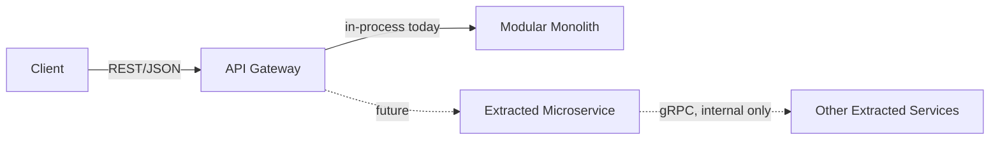

# 07 — API Design

## 1. API Strategy

### 1.1 Why REST First

| Reason | Detail |
|---|---|
| Simplicity | REST over JSON is the fastest way to expose the modular monolith's use cases to clients (web/mobile) without extra tooling |
| Tooling maturity | Swagger/OpenAPI, Postman, and browser dev tools all work naturally with REST — lowers friction while still learning Go |
| Client compatibility | Web and mobile clients consume REST/JSON natively without needing gRPC-web proxies or protobuf codegen on the frontend |
| Matches current architecture | The Modular Monolith exposes one HTTP surface; REST maps cleanly onto that without premature protocol complexity |

### 1.2 How gRPC Fits In Later

gRPC is **not used for client-facing APIs** even after introduction — it is reserved for **internal service-to-service calls** once a module is extracted from the monolith (see `03-system-architecture.md` and `05-folder-structure.md`).



The public REST contract defined in this document does **not change** when a module is extracted — gRPC is purely an internal implementation detail behind the same public endpoints.

### 1.3 API Versioning Strategy

- All routes are prefixed with a version: `/api/v1/...`
- Breaking changes (removed fields, changed semantics) require a new version prefix (`/api/v2/...`); additive changes (new optional fields) do not.
- Version bumps are per-API-surface, not per-module — the whole public API moves together to avoid client-side version-matrix complexity.

### 1.4 Common Conventions (apply to all modules below)

**Authentication:** All endpoints except `POST /auth/register` and `POST /auth/login` require a `Authorization: Bearer <access_token>` header (JWT).

**Authorization:** Enforced via RBAC middleware reading the role(s) embedded in the JWT claims. Each endpoint below states which role(s) may call it.

**Pagination** (for all list endpoints):

| Query Param | Default | Notes |
|---|---|---|
| `page` | 1 | 1-indexed |
| `page_size` | 20 | max 100 |

Response envelope for lists:
```json
{
  "data": [ ... ],
  "meta": {
    "page": 1,
    "page_size": 20,
    "total_items": 134,
    "total_pages": 7
  }
}
```

**Filtering:** query params named after the field, e.g. `?status=confirmed&doctor_id=...`. Documented per-endpoint where relevant.

**Sorting:** `?sort_by=<field>&order=asc|desc`. Default sort is always `created_at desc` unless stated otherwise.

**Standard Error Response:**
```json
{
  "error": {
    "code": "VALIDATION_ERROR",
    "message": "Human-readable summary",
    "details": [
      { "field": "email", "issue": "must be a valid email address" }
    ]
  }
}
```

| HTTP Status | Meaning |
|---|---|
| 400 | Validation error |
| 401 | Missing/invalid authentication |
| 403 | Authenticated but not authorized for this action |
| 404 | Resource not found |
| 409 | Conflict (e.g., slot already booked, duplicate email) |
| 422 | Business rule violation (e.g., insufficient wallet balance) |
| 429 | Rate limit exceeded |
| 500 | Unexpected server error |

**Validation:** Every request body is validated against DTO rules (required fields, formats, ranges) before reaching business logic — validation failures always return `400` with `details`.

**Rate Limiting** (enforced at the router level via Redis counter middleware):

| Endpoint | Limit | Window | Scope |
|---|---|---|---|
| `POST /auth/login` | 5 requests | 1 minute | Per source IP |
| `POST /auth/register` | 10 requests | 1 hour | Per source IP |
| `POST /ai/sessions/*/messages` | 10 requests | 1 minute | Per authenticated user |
| `POST /wallet/top-up` | 20 requests | 1 minute | Per authenticated user |
| All other endpoints | 100 requests | 1 minute | Per authenticated user |

Rate limit responses return HTTP `429` with header `Retry-After: <seconds>`. Redis key pattern: `rate:<scope>:<ip_or_user_id>:<endpoint_slug>`.

---

## 2. Authentication Module

| Endpoint | Method | Auth | Description |
|---|---|---|---|
| `/api/v1/auth/register` | POST | Public | Register as patient or doctor |
| `/api/v1/auth/login` | POST | Public | Returns access + refresh token |
| `/api/v1/auth/refresh` | POST | Public (valid refresh token required) | Issues new access token |
| `/api/v1/auth/logout` | POST | Authenticated | Revokes current refresh token |
| `/api/v1/auth/me` | GET | Authenticated | Returns current user info (id, email, roles) |

**POST `/auth/register`**
Request:
```json
{
  "full_name": "Rina Wijaya",
  "email": "rina@example.com",
  "password": "SecurePass123!",
  "role": "patient"
}
```
Response `201`:
```json
{ "id": "uuid", "email": "rina@example.com", "role": "patient" }
```
Validation:
- `email`: valid format & unique
- `password`: minimum 8 characters, at least 1 uppercase letter, 1 digit, 1 special character (enforced by validator layer; hashed with Argon2id before storage)
- `role`: must be `patient` or `doctor` (self-service only; privileged roles assigned by admin)

**POST `/auth/login`**
Request: `{ "email": "...", "password": "..." }`
Response `200`: `{ "access_token": "...", "refresh_token": "...", "expires_in": 900, "token_type": "Bearer" }`
Errors: `401` on invalid credentials (generic message — never reveal whether email exists).

**POST `/auth/refresh`**
Request: `{ "refresh_token": "..." }`
Response `200`: `{ "access_token": "...", "expires_in": 900 }`
Errors: `401` if token is expired, revoked, or invalid.

**POST `/auth/logout`**
Revokes the current refresh token (sets `revoked_at` in `refresh_tokens` table). Subsequent calls to `/auth/refresh` with that token return `401`.
Optional header `X-All-Devices: true` to revoke all refresh tokens for the user (forced logout from all sessions).

---

## 3. Doctor Module

| Endpoint | Method | Auth | Authorization |
|---|---|---|---|
| `/api/v1/doctors` | GET | Public/Authenticated | Any (list only `is_credential_verified = true` doctors to public; admin sees all) |
| `/api/v1/doctors/{id}` | GET | Authenticated | Any |
| `/api/v1/doctors/me` | GET | Authenticated | Doctor (self) |
| `/api/v1/doctors/me` | PUT | Authenticated | Doctor (self) |
| `/api/v1/doctors/{id}/verify` | POST | Authenticated | Admin only |
| `/api/v1/doctors/{id}/availability` | GET | Authenticated | Any |
| `/api/v1/doctors/me/availability` | POST | Authenticated | Doctor (self) |
| `/api/v1/doctors/me/availability/{slotId}` | DELETE | Authenticated | Doctor (self, only if slot is unbooked) |

**GET `/doctors`** — Filtering: `?specialty=cardiology`. Sorting: `?sort_by=consultation_fee&order=asc`. Pagination applies.
Response item:
```json
{ "id": "uuid", "full_name": "Dr. Amir", "specialty": "cardiology", "consultation_fee": 150000, "is_credential_verified": true }
```

**GET `/doctors/me`** (Doctor only)
Returns the authenticated doctor's full profile including `license_number`, `consultation_fee`, verification status, and unverified-state fields that the public `GET /doctors/{id}` omits.

**POST `/doctors/me/availability`** (Doctor only)
Request:
```json
{ "start_time": "2026-07-10T09:00:00Z", "end_time": "2026-07-10T09:30:00Z" }
```
Response `201`: created availability slot. `409` if overlapping with existing slot for the same doctor.

**POST `/doctors/{id}/verify`** (Admin only)
Marks `is_credential_verified = true`. Writes an `audit_log` entry (`doctor.verified`). `403` if caller is not admin.

---

## 4. Patient Module

| Endpoint | Method | Auth | Authorization |
|---|---|---|---|
| `/api/v1/patients/me` | GET | Authenticated | Patient (self) |
| `/api/v1/patients/me` | PUT | Authenticated | Patient (self) |
| `/api/v1/patients/{id}` | GET | Authenticated | Doctor (only if treating patient), Admin |

> **Profile Completion Gate:** After registration, a patient's profile in the `patients` table is created with minimal data. Before a patient can book an appointment, they must complete their profile via `PUT /patients/me`. The client is responsible for enforcing this gate based on the presence of required fields (`date_of_birth`, `gender`) in the `GET /patients/me` response.

**PUT `/patients/me`**
Request: `{ "date_of_birth": "1995-04-12", "gender": "female", "blood_type": "O+", "phone_number": "+6281234567890" }`
Validation: `date_of_birth` must be a past date; `blood_type` in known enum values; `phone_number` in E.164 format.

---

## 5. Appointment Module

| Endpoint | Method | Auth | Authorization |
|---|---|---|---|
| `/api/v1/appointments` | POST | Authenticated | Patient |
| `/api/v1/appointments` | GET | Authenticated | Patient (own), Doctor (own), Admin (all) |
| `/api/v1/appointments/{id}` | GET | Authenticated | Owner (patient/doctor) or Admin |
| `/api/v1/appointments/{id}/cancel` | POST | Authenticated | Owner (patient/doctor) |
| `/api/v1/appointments/{id}/reschedule` | POST | Authenticated | Owner (patient/doctor) |

**POST `/appointments`** (Patient)
Request:
```json
{ "doctor_id": "uuid", "availability_id": "uuid" }
```
Response `201`:
```json
{ "id": "uuid", "status": "pending", "scheduled_at": "2026-07-10T09:00:00Z" }
```
Errors:
- `409 SLOT_ALREADY_BOOKED` if slot is taken (concurrent booking race)
- `422 INSUFFICIENT_BALANCE` if patient wallet balance is insufficient for the consultation fee
- `422 DOCTOR_NOT_VERIFIED` if target doctor has `is_credential_verified = false`
- `422 PROFILE_INCOMPLETE` if patient has not completed their profile (missing `date_of_birth` or `gender`)

**GET `/appointments`** — Filtering: `?status=confirmed`, `?doctor_id=...` (admin only). Patients/doctors are always scoped to their own records regardless of filters supplied.

**POST `/appointments/{id}/cancel`**
Business rule: cannot cancel within cutoff window (configurable via `APPOINTMENT_CANCEL_CUTOFF_MINUTES`; default 60 minutes) before `scheduled_at` — returns `422 CANCELLATION_WINDOW_EXPIRED` if violated.
Refund: full wallet refund if cancelled ≥ cutoff window in advance; no refund if within cutoff. Refund is processed atomically in the same transaction as the cancellation.

**POST `/appointments/{id}/reschedule`** (Patient or Doctor)
Request: `{ "new_availability_id": "uuid" }`
Business rule: Atomically (1) validates new slot availability, (2) releases old `availability_id` (marks `is_booked = false`), (3) books new slot (marks `is_booked = true`), (4) updates `appointments.availability_id` and `scheduled_at`.
Errors: `409 SLOT_ALREADY_BOOKED`, `422 CANCELLATION_WINDOW_EXPIRED` (if past cutoff), `422 DOCTOR_NOT_VERIFIED`.

---

## 6. Consultation Module

| Endpoint | Method | Auth | Authorization |
|---|---|---|---|
| `/api/v1/consultations/{id}` | GET | Authenticated | Patient/Doctor involved, Admin |
| `/api/v1/consultations/{id}/start` | POST | Authenticated | Doctor (assigned) |
| `/api/v1/consultations/{id}/complete` | POST | Authenticated | Doctor (assigned) |
| `/api/v1/consultations/{id}/notes` | PUT | Authenticated | Doctor (assigned) |

**POST `/consultations/{id}/start`** — transitions `scheduled → in_progress`. `422` if appointment isn't in a startable state.

**PUT `/consultations/{id}/notes`**
Request: `{ "notes": "Patient reports mild fever for 2 days..." }`

---

## 7. Prescription Module

| Endpoint | Method | Auth | Authorization |
|---|---|---|---|
| `/api/v1/prescriptions` | POST | Authenticated | Doctor (during/after consultation) |
| `/api/v1/prescriptions/{id}` | GET | Authenticated | Patient (own), Doctor (issuer), Pharmacy Staff |
| `/api/v1/prescriptions` | GET | Authenticated | Patient (own), scoped by role |

**POST `/prescriptions`** (Doctor)
Request:
```json
{
  "consultation_id": "uuid",
  "items": [
    { "medicine_id": "uuid", "dosage": "500mg twice daily", "quantity": 10, "instructions": "After meals" }
  ]
}
```
Response `201`: created prescription with `status: "active"`.
Validation: `items` must not be empty; `quantity > 0`.

---

## 8. Pharmacy / Orders Module

| Endpoint | Method | Auth | Authorization |
|---|---|---|---|
| `/api/v1/orders` | POST | Authenticated | Patient |
| `/api/v1/orders` | GET | Authenticated | Patient (own), Pharmacy Staff (all), Admin |
| `/api/v1/orders/{id}` | GET | Authenticated | Owner, Pharmacy Staff, Admin |
| `/api/v1/orders/{id}/status` | PUT | Authenticated | Pharmacy Staff |
| `/api/v1/orders/{id}/cancel` | POST | Authenticated | Patient (own, only before `processing` status) |

**POST `/orders`** (Patient — from a prescription)
Request: `{ "prescription_id": "uuid" }`
Optional header: `Idempotency-Key: <client-generated-uuid>` — safe to retry; duplicate key returns original response without creating a new order.
Response `201`: order created with line items copied (and prices snapshotted) from the prescription; wallet is charged atomically. `422 INSUFFICIENT_BALANCE` on insufficient wallet balance. `422 OUT_OF_STOCK` if any medicine stock is insufficient.

**PUT `/orders/{id}/status`** (Pharmacy Staff)
Request: `{ "status": "shipped" }`
Validation: status transitions must follow allowed lifecycle (`pending → processing → shipped → delivered`); invalid transitions return `422 INVALID_STATUS_TRANSITION`.
Side effect: transitioning to `processing` decrements stock; transitioning to `cancelled` (before `processing`) releases stock and refunds wallet.

**GET `/orders`** — Filtering: `?status=pending`. Sorting: `?sort_by=created_at&order=desc` (default).

---

## 9. Inventory Module

| Endpoint | Method | Auth | Authorization |
|---|---|---|---|
| `/api/v1/medicines` | GET | Authenticated | Any |
| `/api/v1/medicines` | POST | Authenticated | Admin/Pharmacy Staff |
| `/api/v1/medicines/{id}` | PUT | Authenticated | Admin/Pharmacy Staff |

**GET `/medicines`** — Filtering: `?name=paracetamol`, `?requires_prescription=true`.

---

## 10. Wallet Module

> **Singleton resource pattern:** `/wallet` uses singular noun because there is exactly one wallet per authenticated patient. This is an intentional deviation from the plural-noun convention used for collection resources (e.g., `/appointments`, `/orders`). The alternative `GET /wallets/me` is equally valid and may be preferred for strict consistency — both are acceptable; choose one and document it.

| Endpoint | Method | Auth | Authorization |
|---|---|---|---|
| `/api/v1/wallet` | GET | Authenticated | Patient (self) |
| `/api/v1/wallet/top-up` | POST | Authenticated | Patient (self) |
| `/api/v1/wallet/transactions` | GET | Authenticated | Patient (self) |

**GET `/wallet`**
Response: `{ "balance": 250000, "currency": "IDR" }`

**POST `/wallet/top-up`**
Request: `{ "amount": 100000 }`
Optional header: `Idempotency-Key: <client-generated-uuid>` — safe to retry; duplicate key returns original transaction record.
Response `201`: transaction record with `type: "top_up"`, updated balance.
Validation: `amount > 0`; upper bound configurable via `WALLET_MAX_TOPUP_AMOUNT` env var to prevent abuse.

**GET `/wallet/transactions`** — Filtering: `?type=order_payment`. Pagination applies (this list can grow large).

---

## 11. Notification Module

| Endpoint | Method | Auth | Authorization |
|---|---|---|---|
| `/api/v1/notifications` | GET | Authenticated | Self (any role) |
| `/api/v1/notifications/{id}/read` | POST | Authenticated | Self |

**GET `/notifications`** — Filtering: `?status=unread`. Notifications are created internally by other modules (not via a public POST endpoint).

---

## 12. AI Assistant Module

> **Session Policy:** Maximum 1 active AI session per patient at a time. Creating a new session while one is active returns `409 ACTIVE_SESSION_EXISTS`. Sessions auto-close after 24 hours of inactivity (background job sets status to `closed`). AI sessions are independent of appointments — a patient may use triage before booking.

| Endpoint | Method | Auth | Authorization |
|---|---|---|---|
| `/api/v1/ai/sessions` | POST | Authenticated | Patient |
| `/api/v1/ai/sessions/{id}/messages` | POST | Authenticated | Patient (own session) |
| `/api/v1/ai/sessions/{id}` | GET | Authenticated | Patient (own), Admin |
| `/api/v1/ai/sessions` | GET | Authenticated | Patient (own history) |

**POST `/ai/sessions/{id}/messages`**
Request: `{ "message": "I have a headache and mild fever since yesterday" }`

> **PHI Protection:** The service layer strips patient name and user ID from the prompt before forwarding to the external LLM. Only anonymized symptom text is sent. The full message is stored in `ai_suggestions.input_summary` for audit, but the LLM only receives anonymized content.

Response `201`:
```json
{
  "suggested_urgency": "low",
  "suggested_specialty": "general_practitioner",
  "disclaimer": "This is not a medical diagnosis. Please consult a licensed doctor for confirmation.",
  "session_id": "uuid"
}
```
Every response includes the non-diagnostic disclaimer per FR-23 in `01-product-requirements.md`.
Errors: `409 ACTIVE_SESSION_EXISTS` if trying to create a new session when one is active; `429` if rate limit exceeded.

---

## 13. Medical Record Module

| Endpoint | Method | Auth | Authorization |
|---|---|---|---|
| `/api/v1/medical-records` | GET | Authenticated | Patient (own), Doctor (if treating), Admin |
| `/api/v1/medical-records` | POST | Authenticated | Doctor (treating), Admin |
| `/api/v1/medical-records/{id}` | GET | Authenticated | Same as above |
| `/api/v1/medical-records/{id}` | PUT | Authenticated | Doctor (treating, issued original record), Admin |
| `/api/v1/medical-records/{id}` | DELETE | Authenticated | Admin only (soft delete) |

Every read of a `medical-records` resource by a doctor or admin writes an `audit_logs` entry (`medical_record.viewed`) via `shared.AuditService.Log` — this happens transparently in the service layer.
Every write (POST/PUT/DELETE) by a doctor or admin also writes an audit entry (`medical_record.created`, `medical_record.updated`, `medical_record.deleted`).

**GET `/medical-records`** — Filtering: `?record_type=diagnosis`. Authorization is record-owner-scoped: a doctor only sees records for patients they have an active or completed consultation with.

**PUT `/medical-records/{id}`** (Doctor/Admin only)
Request: `{ "content": "...", "record_type": "diagnosis" }`
Business rule: update creates an audit trail entry. Only the issuing doctor or an admin may modify a record.

**DELETE `/medical-records/{id}`** (Admin only)
Soft delete: sets `deleted_at`, `deleted_by`. Audit logged. Cannot be called by doctors or patients.

---

## 14. Admin Module

| Endpoint | Method | Auth | Authorization |
|---|---|---|---|
| `/api/v1/admin/users` | GET | Authenticated | Admin |
| `/api/v1/admin/users/{id}` | GET | Authenticated | Admin |
| `/api/v1/admin/users/{id}/suspend` | POST | Authenticated | Admin |
| `/api/v1/admin/users/{id}/roles` | POST | Authenticated | Admin |
| `/api/v1/admin/audit-logs` | GET | Authenticated | Admin |

**POST `/admin/users/{id}/roles`** (Admin only)
Request: `{ "role": "pharmacy_staff" }` — `role` must be a privileged role: `pharmacy_staff`, `admin`. Self-service roles (`patient`, `doctor`) are set at registration.
Response `200`: `{ "user_id": "uuid", "roles": ["pharmacy_staff"] }`
Side effect: writes `audit_log` entry (`user.role_assigned`).

**POST `/admin/users/{id}/suspend`** (Admin only)
Sets `users.status = 'suspended'`. Writes audit log. Suspended users receive `403` on all authenticated endpoints.

**GET `/admin/audit-logs`** — Filtering: `?actor_id=...`, `?action=medical_record.viewed`, `?target_type=medical_records`, `?from=2026-01-01&to=2026-12-31`. Pagination is mandatory (no unbounded fetch of audit history).

---

## 15. File Management Module

| Endpoint | Method | Auth | Authorization |
|---|---|---|---|
| `/api/v1/files` | POST | Authenticated | Any authenticated user |
| `/api/v1/files/{id}` | GET | Authenticated | Owner, Doctor (if file attached to their patient's record), Admin |
| `/api/v1/files/{id}` | DELETE | Authenticated | Owner, Admin |

**POST `/files`** (multipart/form-data upload)
Constraints:
- Max file size: **10 MB** (configurable via `FILE_MAX_SIZE_MB` env var)
- Allowed MIME types: `image/jpeg`, `image/png`, `application/pdf`
- Object key: server-generated UUID — never derived from user-supplied filename (prevents path traversal)
- Content-Type header must match actual file content (validated server-side)

Response `201`:
```json
{
  "id": "uuid",
  "file_name": "lab_result_2026.pdf",
  "content_type": "application/pdf",
  "size_bytes": 204800,
  "presigned_url": "https://storage.example.com/...",
  "presigned_url_expires_at": "2026-07-04T10:15:00Z"
}
```

**GET `/files/{id}`** — Returns a fresh presigned URL (expires in 15 minutes). RBAC checked before generating URL. `403` if caller does not have access rights.

**DELETE `/files/{id}`** — Soft deletes the `files` metadata record and marks the object for deletion in MinIO. Does not immediately delete the object (allows grace period for in-flight requests using the presigned URL).

---

## 16. Cross-Cutting Notes

- **Idempotency:** State-changing financial endpoints (`/wallet/top-up`, `/orders`) accept an optional `Idempotency-Key` header. The key is stored in `wallet_transactions.idempotency_key`. On a duplicate request (same key + same user), the server returns the original response without re-processing. Key must be a client-generated UUID; TTL is 24 hours from first request.
- **Consistent DTO layer:** Every module's `dto/` package (see `05-folder-structure.md`) defines the exact request/response shapes above — the API design in this document *is* the contract those DTOs implement.
- **OpenAPI generation:** These endpoint tables are the source of truth during implementation for generating the `docs/openapi/` specification (via `swaggo` annotations in handler code).
- **Trace ID:** Every response includes `X-Trace-ID` header containing the request's `trace_id` for log correlation.

---

## 17. Error Code Enum (System-wide)

All error responses use a `code` field from this defined set. Clients should handle errors by `code`, not by `message` (messages are human-readable and may change).

| Code | HTTP Status | Meaning | Example Trigger |
|---|---|---|---|
| `VALIDATION_ERROR` | 400 | Input validation failed | Missing required field, invalid email format |
| `UNAUTHORIZED` | 401 | Missing or invalid token | No `Authorization` header, expired access token |
| `TOKEN_EXPIRED` | 401 | JWT or refresh token is expired | Access token past its TTL |
| `TOKEN_REVOKED` | 401 | Refresh token has been revoked | After logout |
| `FORBIDDEN` | 403 | Valid token, insufficient role | Patient calling admin endpoint |
| `NOT_FOUND` | 404 | Resource does not exist | `GET /appointments/invalid-uuid` |
| `CONFLICT` | 409 | Duplicate/concurrent conflict | Duplicate email on register |
| `SLOT_ALREADY_BOOKED` | 409 | Appointment slot taken concurrently | Double-booking race |
| `ACTIVE_SESSION_EXISTS` | 409 | Patient already has active AI session | `POST /ai/sessions` when one is open |
| `BUSINESS_RULE_VIOLATION` | 422 | Generic domain rule violation | Custom rules not covered by specific codes |
| `INSUFFICIENT_BALANCE` | 422 | Wallet balance too low | Booking/order payment |
| `OUT_OF_STOCK` | 422 | Medicine stock insufficient | Order creation |
| `DOCTOR_NOT_VERIFIED` | 422 | Doctor not yet credential-verified | Booking with unverified doctor |
| `CANCELLATION_WINDOW_EXPIRED` | 422 | Past the cancellation cutoff | Cancel/reschedule too close to appointment |
| `INVALID_STATUS_TRANSITION` | 422 | State machine rule violated | Transitioning `pending → shipped` in orders |
| `PROFILE_INCOMPLETE` | 422 | Patient profile missing required fields | Booking without completed profile |
| `RATE_LIMIT_EXCEEDED` | 429 | Too many requests | `POST /auth/login` more than 5x/min |
| `INTERNAL_ERROR` | 500 | Unexpected server error | Unhandled panic, DB connection failure |

---

**End of Phase 2 documentation set.**
