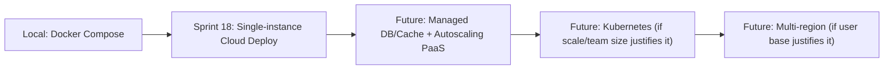

# 09 — Deployment Strategy

## 1. Deployment Philosophy

- **Local-first:** the entire platform must run identically on a laptop as it will in production, minus scale. Docker Compose gives us this parity from Sprint 0.
- **Config over code:** environment differences (local/staging/prod) are expressed through environment variables and config files, never through code branches.
- **Boring infrastructure:** we deliberately avoid Kubernetes, service meshes, or multi-region setups until the Modular Monolith actually needs them (see `11-future-roadmap.md`). Complexity is earned, not assumed.
- **Observability before scale:** we don't scale or extract services (Sprint 16+) before logging/metrics (Sprint 15) exist to tell us whether it worked.

---

## 2. Local Development

### 2.1 Docker Compose

All infrastructure dependencies run via Compose so a new contributor can start working with one command:

```yaml
# deployments/docker-compose.yml (illustrative structure, not final)
services:
  api:
    build: .
    ports: ["8080:8080"]
    env_file: .env
    depends_on: [postgres, redis, minio]
  postgres:
    image: postgres:16
    ports: ["5432:5432"]
  redis:
    image: redis:7
    ports: ["6379:6379"]
  minio:
    image: minio/minio
    ports: ["9000:9000", "9001:9001"]
```

`docker-compose.override.yml` holds local-only tweaks (e.g., mounted source for hot reload) so the base file stays production-representative.

### 2.2 Environment Variables

All configuration flows through environment variables (12-factor style), loaded once at startup:

| Variable | Purpose |
|---|---|
| `APP_ENV` | `development`, `staging`, `production` |
| `HTTP_PORT` | API listen port |
| `DATABASE_URL` | PostgreSQL connection string |
| `REDIS_URL` | Redis connection string |
| `MINIO_ENDPOINT` / `MINIO_ACCESS_KEY` / `MINIO_SECRET_KEY` | Object storage credentials |
| `JWT_SECRET` / `JWT_ACCESS_TTL` / `JWT_REFRESH_TTL` | Auth token signing/expiry |
| `LLM_API_KEY` / `LLM_API_URL` | AI module's external provider |
| `LOG_LEVEL` | `debug`, `info`, `warn`, `error` |

`.env.example` is committed to the repo; `.env` (real values) is gitignored.

### 2.3 Configuration Management

- `configs/config.yaml` defines structure and safe defaults (non-secret).
- Environment variables always override file defaults.
- Config is loaded once into a typed struct at startup and passed via dependency injection — no global config lookups scattered through business logic (keeps `service/` and `model/` layers testable, per `05-folder-structure.md`).

### 2.4 Health Checks

| Endpoint | Purpose |
|---|---|
| `GET /healthz` | Liveness — is the process running |
| `GET /readyz` | Readiness — can it serve traffic (DB/Redis/MinIO reachable) |

Docker Compose and any future orchestrator use `/readyz` to gate traffic; `/healthz` is for basic process liveness.

### 2.5 Logging (Local)

Structured JSON logs via `slog` from Sprint 0 onward, even locally — this avoids a "works on my machine but breaks the log parser in prod" gap. Local dev may pipe through a pretty-printer for readability without changing the underlying log format.

---

## 3. CI/CD Overview

A minimal pipeline, introduced incrementally rather than all at once:

| Stage | When Introduced | What It Does |
|---|---|---|
| Lint + build | Sprint 0 | `go vet`, `golangci-lint`, `go build` on every push |
| Unit tests | Sprint 1 onward | Run on every push/PR |
| Integration tests (testcontainers) | Sprint 4 onward (once transactional logic exists) | Run on PR merge to `main` |
| Docker image build | Sprint 18 | Build and tag image on merge to `main` |
| Deploy | Sprint 18 | Automated deploy to the chosen hosting target on successful build |

Philosophy: **CI/CD should never be a blocker to learning** — it's introduced in step with what actually needs protecting (no integration-test stage before there's a transaction worth testing).

---

## 4. Future Kubernetes Readiness

The project does **not** adopt Kubernetes during the roadmap in `08-development-roadmap.md`. However, the architecture is deliberately kept K8s-compatible:

| Design Choice Made Now | Why It Pays Off Later |
|---|---|
| Stateless API process (no local session state) | Directly horizontally scalable behind a Deployment + Service |
| Config via environment variables | Maps directly to ConfigMaps/Secrets |
| Health check endpoints (`/healthz`, `/readyz`) | Map directly to liveness/readiness probes |
| Single Docker image per service | No rework needed to containerize for K8s |
| Modules already interface-bound (Sprint 16 extraction) | Extracted services become independently deployable pods without further refactor |

When/if Kubernetes is adopted (see `11-future-roadmap.md`), it is an **infrastructure change**, not an application rewrite.

---

## 5. Cloud Deployment Considerations

For Sprint 18 (Production Deployment), the recommended path is the simplest one that satisfies the NFRs in `01-product-requirements.md`:

| Option | When It Fits |
|---|---|
| Single VM + Docker Compose | Simplest path; fine for an early-stage portfolio deployment with low traffic |
| Managed container platform (e.g., a PaaS that runs Docker images directly) | Good middle ground — no Kubernetes, but gets managed scaling/restarts |
| Managed Postgres/Redis (vs. self-hosted in Compose) | Recommended once real users depend on uptime — reduces operational burden of backups/patching |
| Kubernetes / multi-region | Deferred until `11-future-roadmap.md` triggers (real scale, multi-tenant, or team growth) are actually met |

Object storage (MinIO locally) maps directly to a cloud provider's S3-compatible service in production — no code change, only endpoint/credential config change, because the `file` module already speaks the S3 API.

---

## 6. Deployment Evolution Summary



Each arrow is a **deliberate, justified step** — not a default assumption. The architecture supports the jump at each stage without requiring a rewrite, which is the entire point of the Modular Monolith + Clean Architecture decisions made in `03` and `05`.

---

**Next document:** `10-testing-strategy.md` — how testing is structured and when each type is written.
