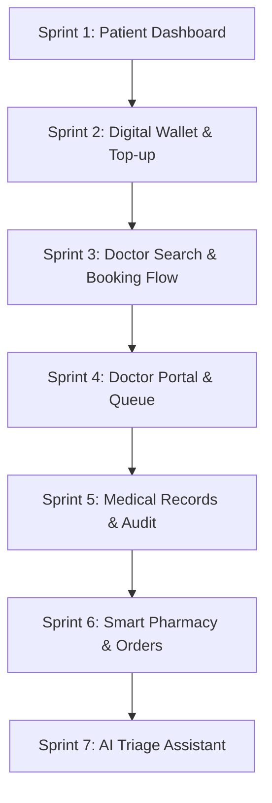

# Frontend 04 — Development Roadmap

Dokumen ini membagi alur pembangunan frontend **TeleMedHub** menjadi **7 Sprint Terfokus** untuk menyelesaikan fungsionalitas MVP. Setiap sprint menyelaraskan template visual dari `web/design-reference/` dengan API modul backend di `internal/`.

---

## 🗺️ Gambaran Umum Alur Sprint

---

## 📋 Rincian Detail Sprint Frontend

### 🏃 Sprint 1: Patient Dashboard (`/patient/*`) — [✅ Selesai / Completed]
*   **Tujuan:** Membangun beranda utama pasien untuk memberikan ringkasan status kesehatan dan keuangan secara sekilas.
*   **Template Visual:** [PatientPortal.html](file:///Users/timurdianradhasejati/Programming/Code/Golang/telemed_hub/web/design-reference/PatientPortal.html) (bagian dashboard ringkasan).
*   **Penyelarasan API (Backend):**
    *   `GET /api/v1/patients/me` (Profile detail pasien)
    *   `GET /api/v1/appointments` (Mengambil 3 appointment terdekat pasien)
*   **Komponen Terlibat:** `Sidebar`, `PageHeader`, `Card`, `StatusBadge`, `Table` (untuk list jadwal).
*   **Tujuan Belajar:** TanStack Route loader prefetching data & parsing profile state.

---

### 🏃 Sprint 2: Digital Wallet & Transactions (`/patient/wallet`) — [✅ Selesai / Completed]
*   **Tujuan:** Menyediakan sistem keuangan internal pasien untuk pembayaran janji temu medis & penebusan resep obat secara aman.
*   **Template Visual:** [DigitalWallet.html](file:///Users/timurdianradhasejati/Programming/Code/Golang/telemed_hub/web/design-reference/DigitalWallet.html).
*   **Penyelarasan API (Backend):**
    *   `GET /api/v1/wallet/balance` (Saldo saat ini)
    *   `GET /api/v1/wallet/transactions` (Log transaksi ledger append-only)
    *   `POST /api/v1/wallet/topup` (Formulir top-up saldo)
*   **Komponen Terlibat:** `Card` (tampilan kartu debit virtual), `Input` (dengan currency formatter), `Table` (daftar log transaksi ledger).
*   **Tujuan Belajar:** Mutasi state finansial secara atomik di frontend & validasi form input uang.

---

### 🏃 Sprint 3: Doctor Search & Booking Flow (`/patient/appointments`) — [✅ Selesai / Completed]
*   **Tujuan:** Membangun modul pencarian dokter spesialis dan alur reservasi jadwal (booking) dengan proteksi double-booking.
*   **Template Visual:** [PatientPortal.html](file:///Users/timurdianradhasejati/Programming/Code/Golang/telemed_hub/web/design-reference/PatientPortal.html) (bagian pencarian dokter & slot).
*   **Penyelarasan API (Backend):**
    *   `GET /api/v1/doctors` (Mencari dan memfilter daftar dokter aktif)
    *   `GET /api/v1/doctors/{id}/availability` (Mengambil slot jadwal kosong dokter)
    *   `POST /api/v1/appointments` (Reservasi slot & bayar otomatis menggunakan saldo wallet)
*   **Komponen Terlibat:** `Avatar`, `Input` (search filter), `Dialog` (konfirmasi booking & checkout detail), custom `Calendar/Time Slots Picker`.
*   **Tujuan Belajar:** Penanganan concurrency booking slot & dialog persetujuan pembayaran di frontend.

---

### 🏃 Sprint 4: Doctor Workspace & Queue (`/doctor/*`) — [✅ Selesai / Completed]
*   **Tujuan:** Menyediakan portal kerja terintegrasi bagi dokter untuk mengelola availability slots, melihat antrean harian, dan melangsungkan sesi konsultasi.
*   **Template Visual:** Komponen antarmuka antrean resep dan rekam medis di [MedicalRecord.html](file:///Users/timurdianradhasejati/Programming/Code/Golang/telemed_hub/web/design-reference/MedicalRecord.html).
*   **Penyelarasan API (Backend):**
    *   `GET /api/v1/appointments` (Filter berdasarkan doctor ID & status harian)
    *   `POST /api/v1/consultations` (Memulai sesi, menulis catatan medis diagnosis)
    *   `POST /api/v1/prescriptions` (Mengeluarkan resep obat digital berupa header & line items)
*   **Komponen Terlibat:** `Tabs`, `Table` (queue), dynamic form inputs (untuk entri daftar obat resep).
*   **Tujuan Belajar:** Penanganan dynamic form inputs arrays (Zod nested arrays) & status state machine konsultasi (scheduled $\rightarrow$ active $\rightarrow$ completed).

---

### 🏃 Sprint 5: Medical Records & Access Auditing (`/patient/records`) — [✅ Selesai / Completed]
*   **Tujuan:** Menampilkan riwayat rekam medis pasien yang sepenuhnya aman dengan verifikasi bahwa setiap akses tercatat di audit log backend.
*   **Template Visual:** [MedicalRecord.html](file:///Users/timurdianradhasejati/Programming/Code/Golang/telemed_hub/web/design-reference/MedicalRecord.html).
*   **Penyelarasan API (Backend):**
    *   `GET /api/v1/medical-records` (List riwayat rekam medis)
    *   `GET /api/v1/medical-records/{id}` (Detail rekam medis, memicu audit log di backend)
*   **Komponen Terlibat:** `Card`, `Dialog` (viewer detail PDF/catatan), `EmptyState`.
*   **Tujuan Belajar:** Fine-grained authorization & verifikasi audit log trail (FR-17).

---

### 🏃 Sprint 6: Smart Pharmacy & Fulfillment (`/patient/orders` & `/pharmacy/*`) — [🔄 Sedang Berjalan / Active]
*   **Tujuan:** Memungkinkan pasien menebus resep obat secara digital, serta menyediakan portal bagi Pharmacy Staff untuk melacak dan memproses pesanan.
*   **Template Visual:** [InventoryLogistic.html](file:///Users/timurdianradhasejati/Programming/Code/Golang/telemed_hub/web/design-reference/InventoryLogistic.html).
*   **Penyelarasan API (Backend):**
    *   `GET /api/v1/prescriptions/{id}` (Melihat detail resep untuk ditebus)
    *   `POST /api/v1/orders` (Membuat pesanan obat & potong saldo wallet)
    *   `GET /api/v1/orders` (List pesanan bagi pasien/pharmacy)
    *   `PATCH /api/v1/orders/{id}/status` (Staff apotek melakukan update status fulfillment)
*   **Komponen Terlibat:** `StatusBadge`, `Table`, `Tabs`, `Alert`.
*   **Tujuan Belajar:** Integrasi lintas-modul (Prescription $\rightarrow$ Order $\rightarrow$ Wallet $\rightarrow$ Inventory decrement).

---

### 🏃 Sprint 7: AI Triage Assistant (`/patient/ai-triage`)
*   **Tujuan:** Integrasi asisten kecerdasan buatan (AI) untuk membantu deteksi gejala awal secara mandiri sebelum memesan janji temu dokter.
*   **Template Visual:** Antarmuka chat bubble interaktif.
*   **Penyelarasan API (Backend):**
    *   `POST /api/v1/ai/sessions` (Membuat sesi triage baru)
    *   `POST /api/v1/ai/sessions/{id}/chat` (Mengirim pesan gejala, menerima rekomendasi terstruktur & disclaimer medis)
*   **Komponen Terlibat:** `Card` (tampilan chat), chat bubbles, text input, auto-scroll container.
*   **Tujuan Belajar:** Integrasi API LLM terstruktur, simulasi streaming teks, dan penanganan timeout/retry API external.
